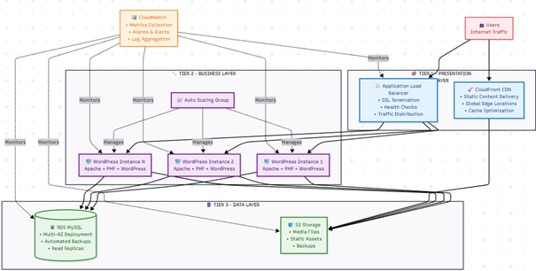

# WordPress 3-Tier Architecture trên AWS với Terraform

 📋 Mô Tả Dự Án

Dự án thực tập xây dựng hạ tầng WordPress 3-tier trên AWS sử dụng Terraform với đầy đủ tính năng production-ready.

 🏗️ Kiến Trúc Hệ Thống
 



Internet → ALB (Public) → WordPress ASG (Private) → RDS MySQL (Database) ↓ S3 Storage + CloudWatch Monitoring

 🚀 Tính Năng Chính

- ✅ **High Availability**: Multi-AZ deployment
- ✅ **Auto Scaling**: Tự động scale based on CPU usage
- ✅ **Security**: Security Groups, IAM roles, encryption
- ✅ **Monitoring**: CloudWatch Dashboard và Alerts
- ✅ **Storage**: S3 integration cho media files
- ✅ **Logging**: Centralized logging với CloudWatch

 💰 Ước Tính Chi Phí

| Service | Configuration | Monthly Cost |
|---------|---------------|--------------|
| EC2 Instances | 2 x t3.micro | ~$17 |
| RDS Database | db.t3.micro | ~$12 |
| Load Balancer | Application LB | ~$16 |
| NAT Gateway | 1 x NAT Gateway | ~$32 |
| S3 Storage | First 50GB | ~$2 |
| Data Transfer | Estimated | ~$5 |
| **Total** | | **~$84/month** |

 🛠️ Cài Đặt và Deployment

 Bước 1: Chuẩn Bị
```bash
# Copy và cấu hình variables
cp terraform.tfvars.example terraform.tfvars
```
# Bước 2: Cấu Hình terraform.tfvars
```bash
# Cập nhật các giá trị sau:
project_name = "wordpress-3tier"
key_name     = "your-aws-key-pair"
db_password  = "your-strong-password"
alert_email  = "your-email@example.com"
```
# Bước 3: Deploy Infrastructure
```bash
# Chạy script deployment
chmod +x scripts/deploy.sh
./scripts/deploy.sh
```
